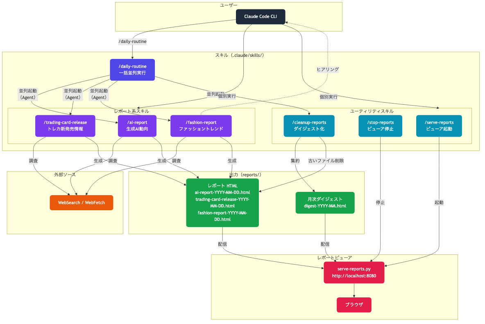

# AutoDailyTask

Claude Code Skills（カスタムスラッシュコマンド）を使って日常タスクを自動化するリポジトリ。

## アーキテクチャ



## 概要

各タスクは `.claude/skills/<skill-name>/SKILL.md` として定義し、Claude Code 上で `/skill-name` として呼び出す。

## 実装済みスキル

### レポート系

| スキル | 概要 | 出力 |
|---|---|---|
| `/ai-report` | 生成AI最新動向（技術・社会実装・開発者知見） | `ai-report-YYYY-MM-DD.html` |
| `/trading-card-release` | トレカ新発売・予約情報 | `trading-card-release-YYYY-MM-DD.html` |
| `/fashion-report` | ファッショントレンド・おすすめコーデ（ヒアリング付き） | `fashion-report-YYYY-MM-DD.html` |

```bash
/ai-report                          # 当日分を生成
/ai-report 2026-04-01               # 日付指定
/trading-card-release               # 全タイトル対象
/trading-card-release ポケモンカード # タイトル絞り込み
/fashion-report                     # ヒアリング後にレポート生成
```

### ユーティリティ

| スキル | 概要 |
|---|---|
| `/daily-routine` | 全レポートスキル + cleanup を並列実行 |
| `/cleanup-reports` | 先々月以前のレポートを月次ダイジェストに集約して元ファイルを削除 |
| `/serve-reports` | レポートビューアを起動（デフォルト: port 8080） |
| `/stop-reports` | レポートビューアを停止 |

```bash
/daily-routine                       # ai-report + trading-card-release + cleanup を並列実行
/daily-routine ai-report,fashion-report  # 指定スキルのみ
/cleanup-reports                     # 古いレポートをダイジェスト化
/serve-reports                       # http://localhost:8080
/stop-reports                        # ビューア停止
```

## セットアップ

```bash
git clone <this-repo>
cd AutoDailyTask
```

## ディレクトリ構造

```
AutoDailyTask/
├── CLAUDE.md                        # Claude Code 向けプロジェクト指示
├── .claude/
│   ├── settings.json                # Hooks 設定
│   ├── skills/                      # スキル定義
│   │   ├── ai-report/
│   │   ├── trading-card-release/
│   │   ├── fashion-report/
│   │   ├── daily-routine/
│   │   ├── cleanup-reports/
│   │   ├── serve-reports/
│   │   └── stop-reports/
│   └── docs/
│       └── skill-template.md
├── scripts/
│   └── serve-reports.py             # レポートビューア Web サーバー
├── docs/
│   ├── architecture.mmd             # アーキテクチャ図（Mermaid ソース）
│   └── architecture.png             # アーキテクチャ図（PNG）
└── reports/                         # 生成レポート（gitignore）
```

## 新しいスキルを追加する

1. `.claude/docs/skill-template.md` を参考に内容を記述
2. `.claude/skills/<skill-name>/SKILL.md` として配置
3. Claude Code で `/skill-name` を実行して動作確認

詳細は [CLAUDE.md](./CLAUDE.md) を参照。
